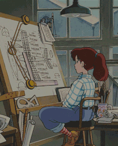
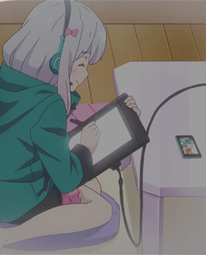
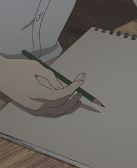
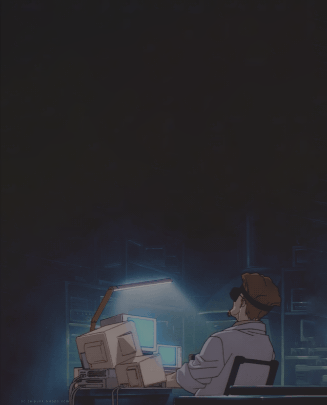
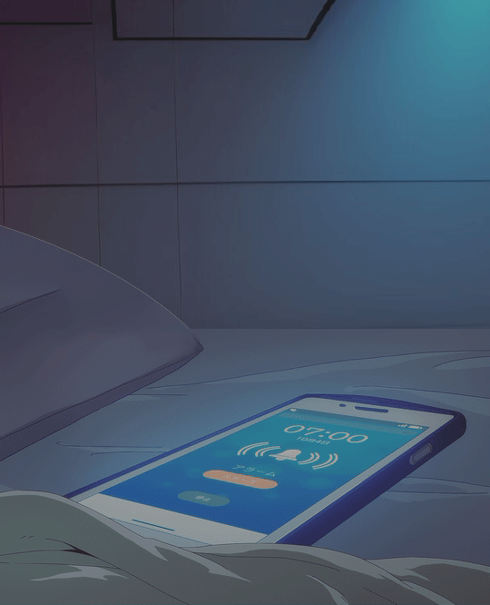
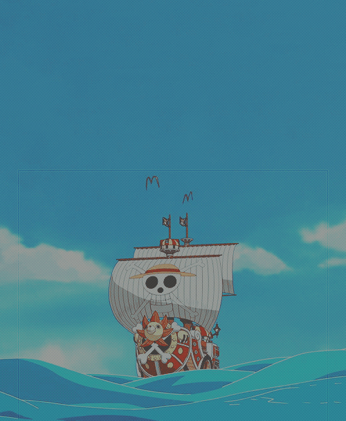
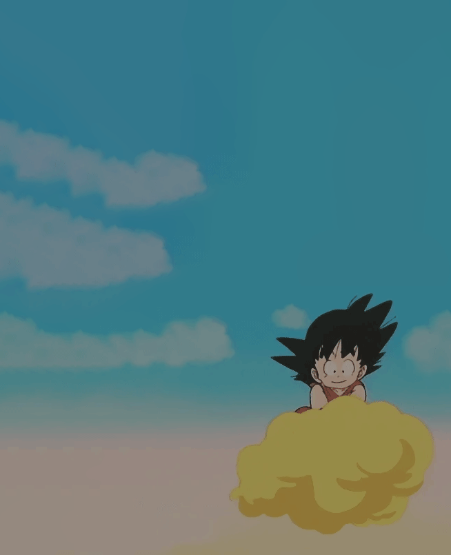

     
    
    
    
    

## 💻 Preview

https://github.com/AllJavi/tartarus-startpage/assets/49349604/9a2a3f4c-33ef-4eb3-9243-cc160a56a181

This start page is based on the [dawn](https://github.com/b-coimbra/dawn) repository, which has even more functionality. I've tweaked the page's style a bit to match my [dotfiles](https://github.com/AllJavi/tartarus-dotfiles), and I've added some features to make it more comfortable.

## ⌨️ Keybindings
| Hotkey                                            | Action                      |
| ------------------------------------------------- | --------------------------- |
| <kbd>Numrow</kbd> \| <kbd>MouseWheel</kbd> \| <kbd>Click</kbd> | Switch tabs            |
| <kbd>s</kbd>                           | Search Dialog            |
| <kbd>q</kbd>                           | Config Dialog (new)           |
| <kbd>Esc</kbd>                           | Close Dialogs            |

## ⚙️ Configuration Dialog

The default configuration file is [userconfig.js](userconfig.js), but you can change it in the configuration dialog. You can find more information about how the file works in the [original repository](https://github.com/b-coimbra/dawn). The available components are tabs, a clock, and weather.

Additionally, there are two different new options:
- `fastlink`: To set the link of the Pokeball button.
- `localIcons`: To optimize the loading time of the icons, you can check it out [here](#local-icons).

## 🔍 Search Dialog

The search dialog allows you to display a search bar with various search engines defined in the configuration. To select each one, you simply need to prefix the query with the corresponding `!<id>`.
By default, the defined search engines are:
- `!g`: google
- `!d`: duckduckgo
- `!y`: youtube
- `!r`: reddit
- `!p`: pinterest

## 🖼 Available banners
|cbg-2|cbg-3|cbg-4|cbg-5|
| ------------- | ------------- | ------------- | ------------- | 
|||||

|cbg-6|cbg-7|cbg-8|cbg-9|
| ------------- | ------------- | ------------- | ------------- |
|||||

|cbg-10|cbg-11|cbg-12|cbg-13|
| ------------- | ------------- | ------------- | ------------- |
|||||

## Local Icons
If you want to reduce the loading time of the icons, you could install the [icon font](https://github.com/AllJavi/tartarus-startpage/tree/master/src/fonts) locally and activate the option `"localIcons": true` in the config to disable the remote styles.

## Credit
- [Dawn Startpage](https://github.com/b-coimbra/dawn) ([preview](https://startpage.metaphoric.dev/))

## License
[MIT License](./LICENSE)
